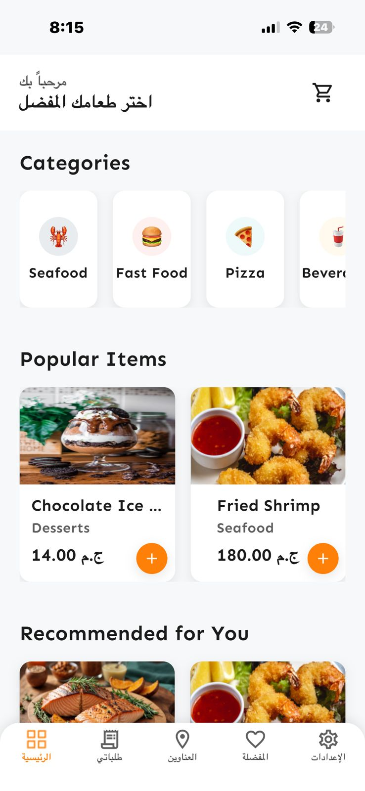
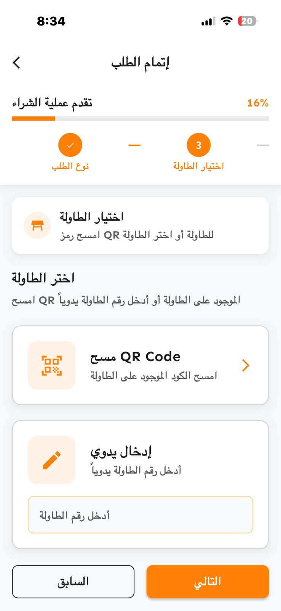
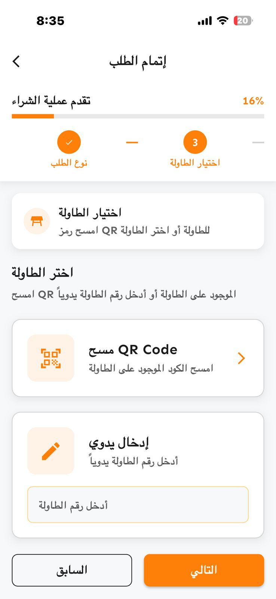
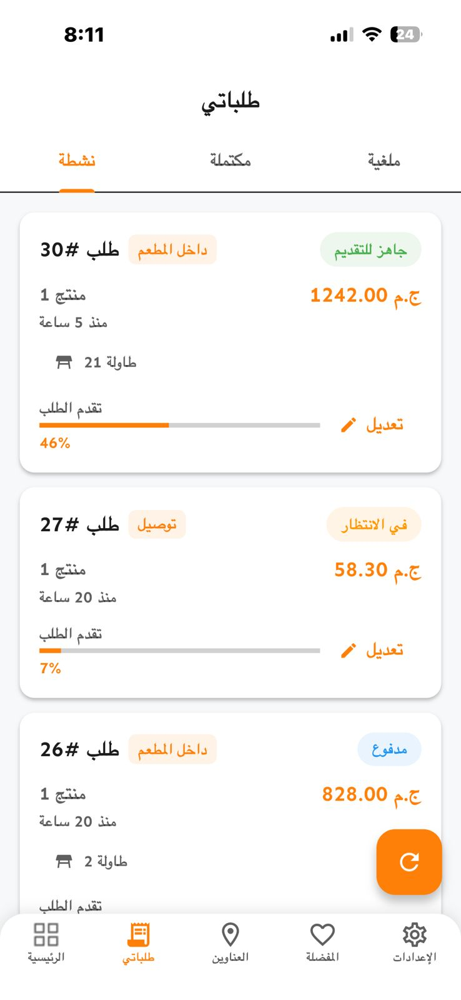
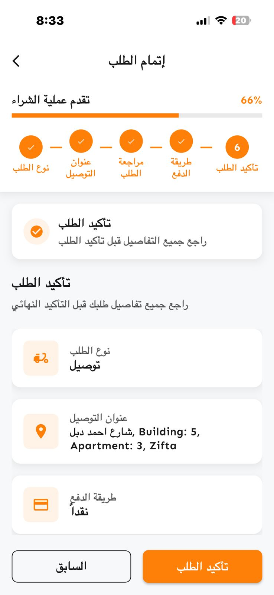
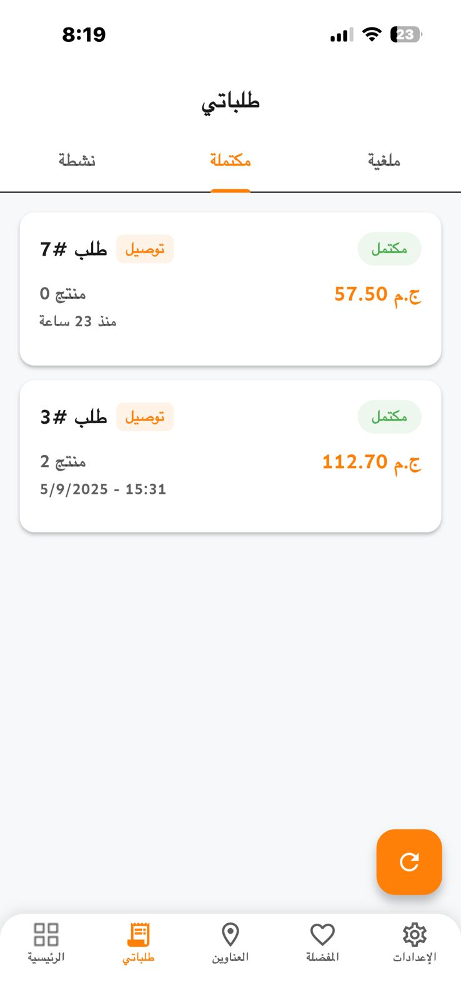
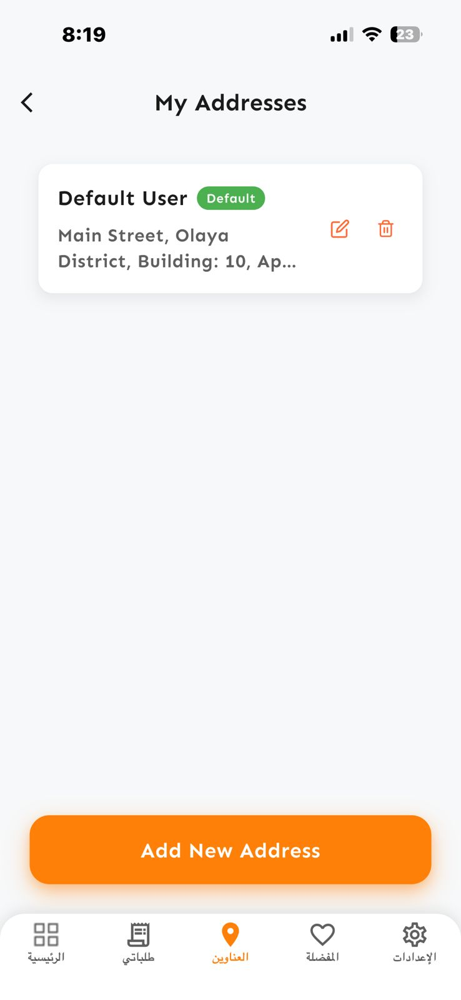
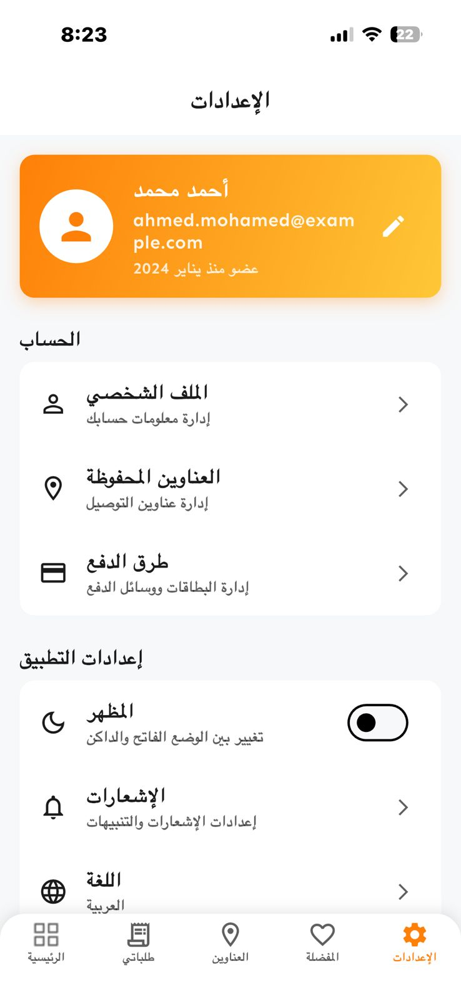

<p align="center"></p>

<p align="center" style="margin-top: 20px;">
    <a href=""></a>
    <a href=""></a>
    <a href=""></a>
    <a href=""></a>
</p>

# Walima Restaurant Management System

A comprehensive digital restaurant management solution built with Flutter and Laravel, offering seamless dining experiences for both customers and restaurant staff.

---

## Features

### Customer Features
- 🔐 **Authentication**
  - Secure login and registration
  - Email verification and password reset
  - User profile management
  - Guest browsing capabilities

- 🍽️ **Digital Dining**
  - QR code table scanning for dine-in orders
  - Digital menu browsing with categories
  - Real-time product search and filtering
  - Shopping cart with instant updates
  - Dual order types (delivery/dine-in)

- 📱 **Order Management**
  - Real-time order tracking
  - Order history and reordering
  - Special instructions support
  - Push notifications for updates
  - Multiple payment methods

- 🎨 **User Experience**
  - Dark/Light theme support
  - Responsive design for all devices
  - Smooth animations and transitions
  - Offline browsing capability
  - Multi-language support (Arabic/English)

### Restaurant Management Features
- 📊 **Admin Dashboard**
  - Real-time statistics and analytics
  - Revenue tracking and reports
  - Performance metrics monitoring
  - User management system

- 🏢 **Operations**
  - Table management with QR codes
  - Real-time order processing
  - Kitchen display system
  - Staff interface and roles
  - Inventory tracking

- 🔧 **Technical Features**
  - RESTful API architecture
  - Real-time broadcasting with Pusher
  - Secure authentication (Laravel Sanctum)
  - File management and storage
  - Database optimization

---

## Tech Stack

### Frontend - Flutter Mobile App
- **Framework:** Flutter 3.8.1
- **Language:** Dart 3.8.1
- **State Management:** BLoC Pattern
- **Architecture:** Clean Architecture
- **UI:** Material Design 3

### Backend - Laravel API
- **Framework:** Laravel 12.0
- **Language:** PHP 8.2+
- **Database:** MySQL/PostgreSQL
- **Authentication:** Laravel Sanctum
- **Admin Panel:** Filament 3.x
- **Real-time:** Pusher

### Key Dependencies
#### Flutter
- `flutter_bloc ^8.1.3` - State management
- `dio ^5.3.2` - HTTP client
- `hive ^2.2.3` - Local storage
- `qr_code_scanner_plus ^2.0.10+1` - QR scanning
- `fl_chart ^1.0.0` - Charts
- `cached_network_image ^3.3.1` - Image caching

#### Laravel
- `filament/filament` - Admin panel
- `laravel/sanctum ^4.1` - API auth
- `pusher/pusher-php-server ^7.2` - Real-time
- `spatie/laravel-permission ^6.20` - Permissions

---

## Screenshots

<p align="center">
  
  
  
  
</p>

<p align="center">
  
  
  
  
</p>

## Getting Started

### Prerequisites

- Flutter SDK (3.8.1 or higher)
- Dart SDK (3.8.1 or higher)
- PHP 8.2 or higher
- Composer 2.x
- Node.js 16+ (for asset compilation)
- MySQL 8.0 or PostgreSQL 13+
- Android Studio / VS Code
- Git
- Android SDK / Xcode (for iOS development)

### Installation

1. Clone the repository:
```bash
git clone https://github.com/yourusername/Walima-Restaurant-System.git
cd Walima-Restaurant-System
```

2. Backend setup (Laravel):
```bash
cd Restaurant-System
composer install
cp .env.example .env
php artisan key:generate
php artisan migrate:fresh --seed
php artisan make:filament-user
php artisan serve
```

3. Frontend setup (Flutter):
```bash
cd ../restaurant_system_flutter
flutter pub get
flutter packages pub run build_runner build
```

4. Configure API endpoint in `lib/core/network/endpoints.dart`:
```dart
// For Android Emulator
static const String baseUrl = 'http://10.0.2.2:8000/api/v1';
// For Real Devices (use your computer's IP)
static const String baseUrl = 'http://192.168.1.X:8000/api/v1';
```

5. Run the app:
```bash
flutter run
```

---

## 📖 API Documentation

### 🔐 Authentication Endpoints
```http
POST /api/v1/auth/register     # User registration
POST /api/v1/auth/login        # User login
GET  /api/v1/user              # Get current user (requires token)
GET  /api/test                 # API health check
```

### 🍽️ Menu & Products (From actual endpoints.dart)
```http
# Public customer endpoints (no token required)
GET /api/v1/menu/meal-times           # Get meal times
GET /api/v1/menu/categories           # Get categories
GET /api/v1/menu/products             # Get products

# Public browsing endpoints (no token required)
GET /api/v1/public/meal-times         # Get meal times
GET /api/v1/public/meal-times/current # Get current meal time
GET /api/v1/public/categories         # Get categories
GET /api/v1/public/products           # Get products
GET /api/v1/public/products/recommended  # Get recommended products
GET /api/v1/public/products/popular   # Get popular products
GET /api/v1/public/products/new       # Get new products
```

### 🛒 Shopping Cart (requires token)
```http
GET    /api/v1/cart               # View shopping cart
POST   /api/v1/cart/items         # Add item to cart
PUT    /api/v1/cart/items/{item}  # Update cart item
DELETE /api/v1/cart/items/{item}  # Remove item from cart
DELETE /api/v1/cart/clear         # Clear cart
```

### 🪑 Table Management
```http
GET  /api/v1/tables/qr/{qrCode}       # Get table by QR code
POST /api/v1/tables/{table}/occupy    # Occupy table
```

### 📦 Order Management (requires token)
```http
GET    /api/v1/orders                 # Get user orders
POST   /api/v1/orders/place           # Place order (dine-in or delivery)
GET    /api/v1/orders/{order}         # Get order details
DELETE /api/v1/orders/{order}/cancel  # Cancel order
POST   /api/v1/orders/{order}/mark-paid  # Mark order as paid
```

### 🔧 Admin Endpoints (requires admin role)
```http
# Product Management
GET    /api/v1/admin/products         # List products
POST   /api/v1/admin/products         # Create product
PUT    /api/v1/admin/products/{id}    # Update product
DELETE /api/v1/admin/products/{id}    # Delete product

# Order Management
GET    /api/v1/admin/orders           # List all orders
PUT    /api/v1/admin/orders/{id}/status  # Update order status
GET    /api/v1/admin/dashboard/statistics  # Dashboard statistics
```

> 📚 **Full API Documentation**: See [Restaurant-System/README_API.md](Restaurant-System/README_API.md) for complete details.

---

## 🏗️ Project Architecture

### Flutter App Structure (From actual project)
```
lib/
├── core/                    # Core functionality
│   ├── config/             # App configuration
│   ├── constants/          # App constants
│   ├── di/                 # Dependency Injection
│   ├── entities/           # Domain entities
│   ├── network/            # Network layer and endpoints.dart
│   ├── routes/             # App routing
│   ├── services/           # Core services
│   ├── theme/              # App theming
│   ├── utils/              # Utility functions
│   └── widgets/            # Reusable widgets
├── features/               # Feature modules (Clean Architecture)
│   ├── auth/               # Authentication (login/register)
│   ├── Home/               # Home screen
│   ├── menu/               # Menu browsing
│   ├── cart/               # Shopping cart
│   ├── orders/             # Order management with REFACTORING_SUMMARY.md
│   ├── admin/              # Admin features (dashboard, products, categories)
│   ├── address/            # Address management
│   ├── checkout/           # Checkout process
│   ├── OnBoarding/         # Onboarding screens
│   ├── splash/             # Splash screen
│   └── settings/           # App settings
└── main.dart               # App entry point (Restaurant System)
```

### Laravel Backend Structure (From actual project)
```
Restaurant-System/
├── app/
│   ├── Filament/           # Admin panel resources (Filament)
│   │   ├── Resources/      # ProductResource, OrderResource, etc.
│   │   └── Widgets/        # RestaurantStatsWidget
│   ├── Http/Controllers/   # API controllers
│   ├── Models/             # Eloquent models (Product, Order, User)
│   └── Services/           # Business logic
├── database/
│   ├── migrations/         # Database migrations
│   └── seeders/           # Data seeders
├── routes/
│   ├── api.php            # API routes (v1 prefix)
│   └── web.php            # Web routes
├── config/                # Configuration files
│   ├── broadcasting.php   # Pusher settings
│   └── sanctum.php        # Authentication settings
└── composer.json          # PHP dependencies
```

### Advanced Features
- **Clean Architecture** in Flutter with separated Data/Domain/Presentation layers
- **BLoC Pattern** for state management
- **Repository Pattern** for data access
- **Filament Admin Panel** for comprehensive management
- **Real-time Updates** with Pusher
- **Multi-language Support** (Arabic and English)

---

## 🔧 Configuration

### 📱 Mobile App Configuration

1. **API Configuration** (`lib/core/config/api_config.dart`)
2. **Theme Configuration** (`lib/core/theme/app_theme.dart`)
3. **Route Configuration** (`lib/core/routes/app_routes.dart`)

### 🖥️ Backend Configuration

1. **Database Configuration** (`.env` and `config/database.php`)
2. **Pusher Configuration** (`.env` and `config/broadcasting.php`)
3. **Filament Configuration** (`app/Providers/Filament/AdminPanelProvider.php`)

---

## Building for Production

### Android
```bash
flutter build apk --release
```

### iOS
```bash
flutter build ios --release
```

## Testing

Run the tests using:
```bash
# Flutter tests
cd restaurant_system_flutter
flutter test

# Laravel tests
cd Restaurant-System
php artisan test
```

---

## Project Structure

```
Walima-Restaurant-System/
├── Restaurant-System/          # Laravel Backend
│   ├── app/
│   │   ├── Filament/          # Admin panel resources
│   │   ├── Http/Controllers/  # API controllers
│   │   ├── Models/            # Eloquent models
│   │   └── Services/          # Business logic
│   ├── database/
│   │   ├── migrations/        # Database migrations
│   │   └── seeders/          # Data seeders
│   ├── routes/
│   │   ├── api.php           # API routes
│   │   └── web.php           # Web routes
│   └── config/               # Configuration files
└── restaurant_system_flutter/ # Flutter Mobile App
    ├── lib/
    │   ├── core/             # Core functionality
    │   │   ├── network/      # API endpoints
    │   │   ├── theme/        # App theming
    │   │   └── utils/        # Utilities
    │   ├── features/         # Feature modules
    │   │   ├── auth/         # Authentication
    │   │   ├── home/         # Home screen
    │   │   ├── menu/         # Menu browsing
    │   │   ├── cart/         # Shopping cart
    │   │   ├── orders/       # Order management
    │   │   └── admin/        # Admin features
    │   └── main.dart         # Entry point
    └── assets/               # Images and assets
```

---

## Contributing

1. Fork the repository
2. Create your feature branch (`git checkout -b feature/AmazingFeature`)
3. Commit your changes (`git commit -m 'Add some AmazingFeature'`)
4. Push to the branch (`git push origin feature/AmazingFeature`)
5. Open a Pull Request

## License

This project is licensed under the MIT License - see the [LICENSE](LICENSE) file for details.

## Support

For support, email elmelegy.dev@gmail.com

## Acknowledgments

- Flutter team for the amazing framework
- Laravel team for the robust backend framework
- Filament team for the beautiful admin panel
- Pusher for real-time functionality

---

<div align="center">

**⭐ Star this repository if you find it helpful!**

Made with ❤️ by the Walima Restaurant System Team

</div>
