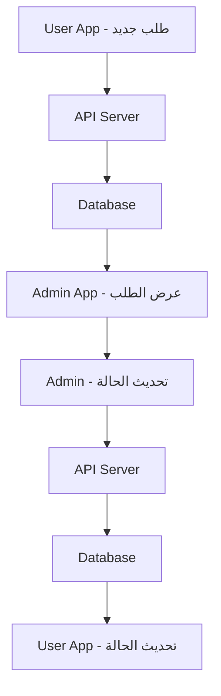

# نظام إدارة الطلبات - Restaurant Orders System

## 📋 نظرة عامة على النظام

تم تطوير نظام إدارة الطلبات بالكامل لتطبيق المطعم، ويتكون من جزئين رئيسيين:

### 🏪 **تطبيق الأدمن (Admin App)**
- إدارة الطلبات من جانب المطعم
- عرض الطلبات النشطة والجديدة
- تحديث حالة الطلبات (تم الإنجاز/إلغاء)

### 👤 **تطبيق المستخدم (User App)**
- طلب الطعام من المطعم
- تتبع حالة الطلب
- عرض تاريخ الطلبات

---

## 🏗️ البنية التقنية (Technical Architecture)

### 📁 هيكل المجلدات
```
lib/features/orders/
├── data/
│   ├── models/
│   │   └── order_model.dart          # نموذج البيانات
│   └── repositories/
│       └── order_repository_impl.dart # تنفيذ قاعدة البيانات
├── domain/
│   ├── entities/
│   │   └── order_entity.dart         # كيان الطلب
│   ├── repositories/
│   │   └── order_repository.dart     # واجهة قاعدة البيانات
│   └── usecases/
│       ├── get_running_orders_usecase.dart    # جلب الطلبات النشطة
│       ├── mark_order_done_usecase.dart       # إنجاز الطلب
│       └── cancel_order_usecase.dart          # إلغاء الطلب
└── presentation/
    ├── bloc/
    │   ├── order_bloc.dart           # إدارة الحالة
    │   ├── order_event.dart          # الأحداث
    │   └── order_state.dart          # الحالات
    └── widgets/
        └── orders_bottom_sheet.dart   # واجهة الطلبات
```

---

## 🔄 العلاقة بين تطبيق الأدمن وتطبيق المستخدم

### 📊 **تدفق البيانات (Data Flow)**



### 🎯 **حالات الطلب (Order States)**

| الحالة | الأدمن | المستخدم | الوصف |
|--------|--------|----------|--------|
| **جديد** | ✅ يظهر في "New Orders" | ✅ يظهر في "طلباتي" | طلب جديد تم استلامه |
| **قيد التحضير** | ✅ يظهر في "Active Orders" | ✅ يظهر في "قيد التحضير" | الطلب قيد الإعداد |
| **جاهز** | ✅ يظهر في "Ready Orders" | ✅ يظهر في "جاهز للاستلام" | الطلب جاهز |
| **مكتمل** | ✅ يظهر في "Completed" | ✅ يظهر في "مكتمل" | تم تسليم الطلب |
| **ملغي** | ✅ يظهر في "Cancelled" | ✅ يظهر في "ملغي" | تم إلغاء الطلب |

---

## 🎨 الميزات المنجزة (Implemented Features)

### 📱 **تطبيق الأدمن (Admin Dashboard)**

#### ✅ **OrdersSection Widget**
- عرض عدد الطلبات النشطة والجديدة
- تصميم بطاقات جذاب مع الأرقام
- قابل للنقر لفتح Bottom Sheet

#### ✅ **Orders Bottom Sheet**
- **قائمة الطلبات**: عرض تفصيلي للطلبات
- **صورة الطبق**: placeholder مع أيقونة الطعام
- **تفاصيل الطلب**: 
  - اسم الطبق
  - الفئة (مثل: #Breakfast)
  - رقم الطلب (ID)
  - السعر
- **أزرار الإجراءات**:
  - زر "Done" برتقالي لإنجاز الطلب
  - زر "Cancel" أحمر لإلغاء الطلب

#### ✅ **تفاعل المستخدم**
- **Pull-to-Refresh**: سحب للأسفل لتحديث القائمة
- **Loading States**: مؤشرات تحميل أثناء العمليات
- **Success/Error Messages**: رسائل نجاح وخطأ
- **Auto-refresh**: تحديث تلقائي بعد الإجراءات

### 🎯 **إدارة الحالة (State Management)**

#### ✅ **BLoC Pattern**
```dart
// الأحداث (Events)
- LoadRunningOrders    // تحميل الطلبات النشطة
- LoadNewOrders        // تحميل الطلبات الجديدة
- MarkOrderAsDone      // إنجاز طلب
- CancelOrder          // إلغاء طلب

// الحالات (States)
- OrderLoading         // جاري التحميل
- RunningOrdersLoaded  // تم تحميل الطلبات النشطة
- NewOrdersLoaded      // تم تحميل الطلبات الجديدة
- OrderActionSuccess   // نجح الإجراء
- OrderError           // خطأ
```

---

## 🔧 التقنيات المستخدمة (Technologies Used)

### 🏗️ **Clean Architecture**
- **Domain Layer**: الكيانات وحالات الاستخدام
- **Data Layer**: النماذج ومستودعات البيانات
- **Presentation Layer**: BLoC والواجهات

### 📦 **Dependencies**
```yaml
flutter_bloc: ^8.1.3          # إدارة الحالة
equatable: ^2.0.5             # مقارنة الكائنات
flutter_screenutil: ^5.9.0    # التصميم المتجاوب
```

### 🎨 **UI/UX Features**
- **Responsive Design**: تصميم متجاوب لجميع الشاشات
- **Material Design**: تصميم مادي حديث
- **Dark/Light Theme**: دعم الثيمات المختلفة
- **Smooth Animations**: حركات سلسة

---

## 🚀 كيفية الاستخدام (How to Use)

### 📱 **للمطورين (For Developers)**

#### 1. **إضافة طلب جديد**
```dart
// في تطبيق المستخدم
final order = OrderEntity(
  id: 12345,
  name: "Chicken Biryani",
  category: "Main Course",
  price: 25.0,
  status: "new",
  createdAt: DateTime.now(),
);
```

#### 2. **عرض الطلبات في الأدمن**
```dart
// في تطبيق الأدمن
OrdersSection(
  title: 'Active Orders',
  orderCount: 20,
)
```

#### 3. **إدارة الطلبات**
```dart
// تحديث حالة الطلب
context.read<OrderBloc>().add(MarkOrderAsDone(orderId));
context.read<OrderBloc>().add(CancelOrder(orderId));
```

### 👥 **للمستخدمين النهائيين (For End Users)**

#### **في تطبيق الأدمن:**
1. افتح لوحة التحكم
2. انقر على "Active Orders" أو "New Orders"
3. ستظهر قائمة الطلبات في Bottom Sheet
4. استخدم أزرار "Done" أو "Cancel" لإدارة الطلبات
5. اسحب للأسفل لتحديث القائمة

#### **في تطبيق المستخدم:**
1. اختر الأطباق من القائمة
2. أضف إلى السلة
3. أكمل الطلب
4. تتبع حالة الطلب في "طلباتي"

---

## 🔄 API Integration

### 📡 **Endpoints المطلوبة**

```dart
// جلب الطلبات
GET /api/orders/running
GET /api/orders/new

// تحديث حالة الطلب
PUT /api/orders/{id}/status
{
  "status": "done" | "cancelled"
}

// إنشاء طلب جديد
POST /api/orders
{
  "items": [...],
  "total": 25.0,
  "customer_id": 123
}
```

### 🔐 **Authentication**
- Bearer Token للتحقق من الهوية
- Role-based Access Control
- Admin: إدارة جميع الطلبات
- User: إدارة طلباته فقط

---

## 🧪 Testing

### ✅ **Unit Tests**
```dart
// اختبار Use Cases
test('should return running orders', () async {
  // implementation
});

// اختبار BLoC
test('should emit RunningOrdersLoaded when LoadRunningOrders is added', () {
  // implementation
});
```

### ✅ **Widget Tests**
```dart
// اختبار Bottom Sheet
testWidgets('should display orders list', (tester) async {
  // implementation
});
```

---

## 🚧 التطوير المستقبلي (Future Development)

### 📈 **الميزات المخطط لها**

#### **تطبيق الأدمن:**
- [ ] **Real-time Updates**: تحديثات فورية للطلبات
- [ ] **Order Notifications**: إشعارات للطلبات الجديدة
- [ ] **Order Analytics**: إحصائيات الطلبات
- [ ] **Kitchen Display**: شاشة عرض للمطبخ
- [ ] **Order Queue**: قائمة انتظار الطلبات

#### **تطبيق المستخدم:**
- [ ] **Order Tracking**: تتبع تفصيلي للطلب
- [ ] **Estimated Time**: وقت تقديري للتوصيل
- [ ] **Order History**: سجل الطلبات السابقة
- [ ] **Reorder**: إعادة طلب سابق
- [ ] **Order Reviews**: تقييم الطلبات

#### **النظام العام:**
- [ ] **Push Notifications**: إشعارات فورية
- [ ] **Payment Integration**: دمج الدفع
- [ ] **Delivery Tracking**: تتبع التوصيل
- [ ] **Multi-language**: دعم اللغات المتعددة

---

## 📞 الدعم والمساعدة

### 🐛 **الإبلاغ عن الأخطاء**
إذا واجهت أي مشاكل، يرجى:
1. فحص console logs
2. التأكد من اتصال الإنترنت
3. إعادة تشغيل التطبيق
4. التواصل مع فريق التطوير

### 📚 **الوثائق الإضافية**
- [Flutter Documentation](https://flutter.dev/docs)
- [BLoC Pattern](https://bloclibrary.dev/)
- [Clean Architecture](https://blog.cleancoder.com/uncle-bob/2012/08/13/the-clean-architecture.html)

---

## 📄 الترخيص (License)

هذا المشروع مرخص تحت رخصة MIT. راجع ملف LICENSE للتفاصيل.

---

**تم التطوير بواسطة فريق Restaurant System Team** 🍕 